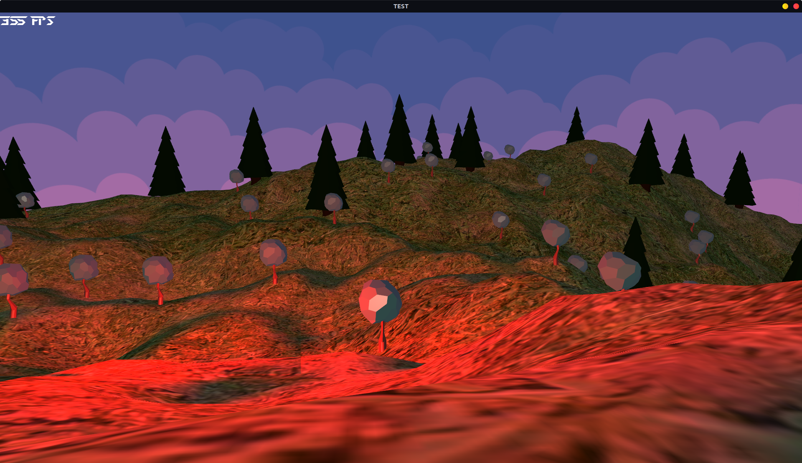

# mfengine
My personal game engine attempt...

Check this out if you would like to join in on the madness!
https://trello.com/b/BmizwhuA/mfengine

**UPDATE #5**
* Added an OBJ parser
* Added Instanced Rendering
* Added a Master Renderer
* Added the cl_setdrawmode command to the terminal
* Added material lighting properties

**UPDATE #4**
* Fixed terrain normals
* Added better lighting including ambient, diffuse and specular lighting
* Added Skybox
* Added basic player physics
* Added terrain collision

**UPDATE #3**
* Added better terrain generation control
* Added basic texture capability to meshes
* Added simple lighting with no material yet
* Reworked certain architectures

**UPDATE #2**
* Added Camera movement
* Made movement follow camera direction
* Made cursor graped and hidden when in game
* Stylized the terminal and GUI elements
* Created overflow options for GUI elements

**UPDATE #1**
* Added basic console/terminal with a small bunch of commands
* Added more basic elements to the GUI collection
* Added camera and camera controls

**Features so far:**
* *Height map terrain generation.*
* *Ressource Manager*
* *Basic GUI*

